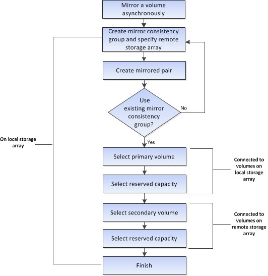

= Workflow für die asynchrone Spiegelung eines Volumes
:allow-uri-read: 
:icons: font
:imagesdir: ../media/

[role="lead"]
Im System Manager können Sie ein Volume asynchron spiegeln, indem Sie diese Schritte durchführen.

== Workflow zum Abschluss eines gespiegelten Paars für primäre Volumes auf einem alten System, das nicht mit System Manager gemanagt wird

Wenn Sie auf einem älteren System ein primäres Volume erstellt haben, das nicht mit System Manager gemanagt wird, können Sie das sekundäre Volume mit SANtricity System Manager erstellen.

image::../media/workflow-for-mirroring-volume-asynchronously.png[Workflow für die asynchrone Spiegelung von Volumes]
